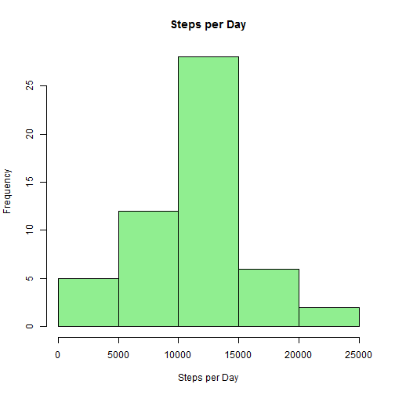
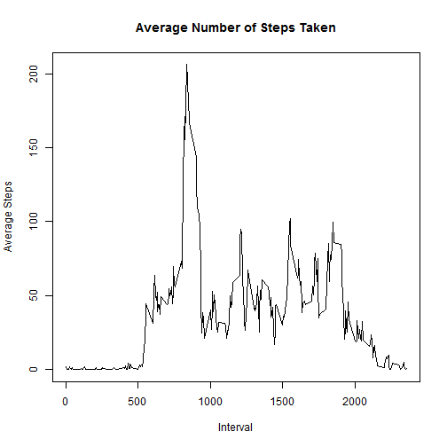
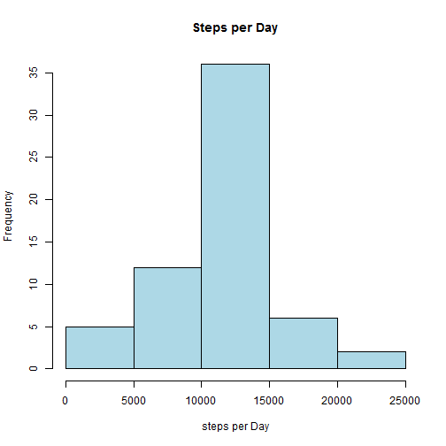
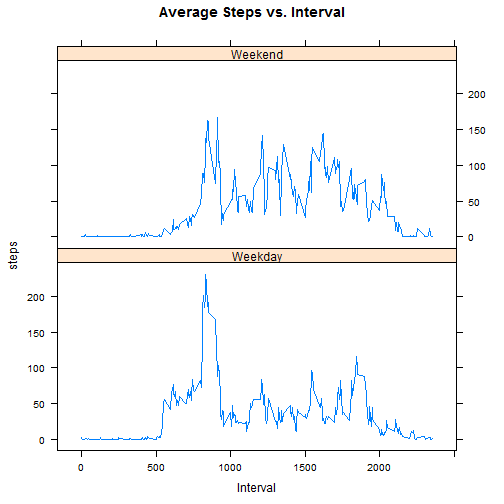

# Reproducible Research: Peer Assessment 1
## Set directory and library necessary packages--  You will need to install knitr and lattice if not installed

```r
    setwd("~/GitHub/RepData_PeerAssessment1")
    library("knitr")
    library(lattice) 
```

## Loading and preprocessing the data

```r
    activity<-read.csv("activity.csv")
```


## What is mean total number of steps taken per day?

```r
# sum daily steps
    stepsPerDay<-aggregate(steps~date, data=activity, sum)

#plot
    hist(stepsPerDay$steps, main="Steps per Day", xlab="Steps per Day", col="lightgreen")
```

 

```r
# mean and median
    mean(stepsPerDay$steps)
```

```
## [1] 10766
```

```r
    median(stepsPerDay$steps)
```

```
## [1] 10765
```

## What is the average daily activity pattern?

```r
# average by interval
     pattern<-aggregate(steps~interval, data=activity, mean) 
# plot
plot(pattern$interval, pattern$steps, pch=19, main="Average Number of Steps Taken", 
     xlab="Interval", ylab="Average Steps", type = "l")
```

 

```r
#Print the interval with the largest average number of steps
maxstep=max(pattern$steps)
pattern[pattern$steps==maxstep,1]
```

```
## [1] 835
```

## Inputing missing values

```r
# report the number of missing step values
sum(is.na(activity$steps))  
```

```
## [1] 2304
```

```r
# Fill missing steps with the rounded average steps for its time interval
     meanstep<-aggregate(steps~interval, data=activity, mean)

# Simple function to replace missing value with specified value
     fillNA<-function(x, y) ifelse(is.na(x),y,x)

# Exploit the fact that the meansteps is in interval order
# since it is shorter than activity it will repeat for each day
     steps<-fillNA(activity$steps,round(meanstep$steps,digits=0))
     activity2<-cbind(steps,activity[,2:3])

# plots and counts from above repeated on activity2
     stepsPerDay2<-aggregate(steps~date, data=activity2, sum)
     hist(stepsPerDay2$steps, main="Steps per Day", xlab="steps per Day", col="lightblue")
```

 

```r
     mean(stepsPerDay2$steps)
```

```
## [1] 10766
```

```r
     median(stepsPerDay2$steps)
```

```
## [1] 10762
```

Commparing these numbers to the  results without replacing the missing values, we see there is little differnce between the results when the missing data is filled in with average interval values.

```r
# Old vs. new results with missing values
    mean(stepsPerDay$steps); mean(stepsPerDay2$steps)
```

```
## [1] 10766
```

```
## [1] 10766
```

```r
    median(stepsPerDay$steps); median(stepsPerDay2$steps)
```

```
## [1] 10765
```

```
## [1] 10762
```


## Are there differences in activity patterns between weekdays and weekends?
### define weekends and weekdays

```r
activity2$dow<-weekdays(as.Date(activity2$date))

# function to label weekday or weekend
     dayend<- function(x) ifelse((x=="Sunday" | x=="Saturday"), x<-"Weekend", x<-"Weekday")
     activity2$dow2<-dayend(activity2$dow)
# storeaverages for interval for both weekday/end
     meanstep2<-aggregate(steps~interval+dow2, data=activity2, mean) 

# lattice plot
     xyplot(steps~interval | dow2, data=meanstep2, main="Average Steps vs. Interval", ylab="steps", 
            xlab="Interval", type="l", layout=c(1,2))
```

 

